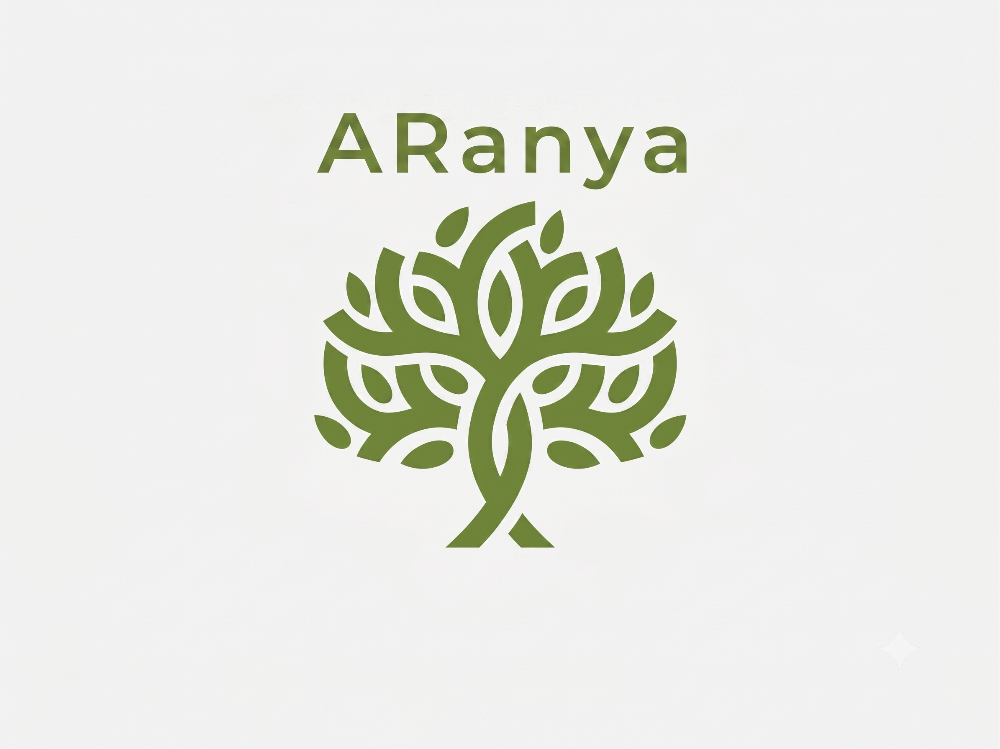

<div align="center">



# ARanya
### India's Biodiversity OS

**An AI-powered, real-time plant identification and citizen science platform built for India's biodiversity ecosystem.**

[](https://aranyavit.vercel.app)
[](https://react.dev)
[](https://expressjs.com)
[](https://firebase.google.com)
[](https://ai.google.dev)

</div>

---

## What is ARanya?

ARanya (आरण्य — Sanskrit for "forest") is a full-stack progressive web app that turns anyone's phone into a botanical field guide. Point your camera at any plant, and ARanya identifies it in real time using the Pl@ntNet computer vision API, overlays the name in an AR-style chip on your live camera feed, and — if you want to go deeper — slides up a detailed profile covering the plant's conservation status, native region, ecological role, and historical context.

Every discovery gets logged to a Firestore-backed journal and earns gamification points. A global leaderboard, achievement badges, and an interactive map of all your discoveries round out the experience. An AI Botanist chatbot (powered by Gemini) is available at any time to answer follow-up questions.

ARanya is built to work as a **Progressive Web App**: it can be installed on any Android or iOS device directly from the browser with no app store required.

---

## ✨ Feature Breakdown

### 🌿 Real-Time AR Plant Scanner
The core experience. The dashboard shows a camera scanner that auto-captures a frame every 2 seconds and sends it to the backend for identification via [Pl@ntNet](https://plantnet.org/).

- **Live camera feed** with a sci-fi viewfinder reticle and animated scanning laser.
- **AR name chip** overlaid on the video — tappable to open the full detail sheet.
- **Auto-scan mode**: Scans automatically at 2-second intervals until a confident result is found, then switches to **manual shutter mode** to give the user control.
- **Confidence badge**: Shows match percentage; warns visually if confidence is below 60%.
- **Unknown species handling**: If the plant can't be named, the chip shows a non-tappable "Unknown Species" state instead of crashing or showing incomplete data.

### 📋 Plant Detail Sheet
A smooth slide-up panel that appears when a plant is identified:

| Field | Source |
|---|---|
| Common & Scientific Name | Pl@ntNet + Firestore |
| Plant Family | Firestore / Gemini-generated |
| Native Region | Firestore / Gemini-generated |
| Conservation Status | Firestore / Gemini-generated |
| Ecological Importance | Firestore / Gemini-generated |
| Threats | Firestore / Gemini-generated |
| Conservation Practices | Firestore / Gemini-generated |
| Historical Context | Firestore / Gemini-generated |

- **"Log to Journal"** button triggers the gamification pipeline.
- **"Ask Botanist AI"** button opens the in-context chat window.

### 🤖 Auto-Population of Unknown Plants
When a plant is identified by Pl@ntNet but doesn't exist in ARanya's Firestore database yet, the app silently triggers a background Gemini API call to generate a complete botanical profile and save it to the database. The next scan of the same plant will be instant.

### 💬 AI Botanist Chat
A conversational AI botanical guide accessible from anywhere in the app:

- Persona-driven system prompt: the AI acts as a "passionate conservationist based in India."
- Returns a `reply_text`, two specific `suggested_followup_queries`, and a `chat_title` in structured JSON.
- Automatic 3-retry logic for Gemini 503 (overload) errors.
- Context-aware: when opened from a plant's detail sheet, it knows which plant you're asking about.
- Chat history is stored in Firestore under `chat_threads` and accessible from the sidebar.

### 🗺️ Species Map
An interactive map (built with **React-Leaflet**) that plots all of the user's discovered plants as green markers:

- Your current GPS location is shown as a blue marker.
- Clicking a plant marker on the map or a card in the sidebar highlights it.
- The map smoothly flies (`flyTo`) to the selected location.
- Falls back to mock discovery data if the backend is unreachable.

### 🏆 Gamification & Achievements
A full progression system stored in Firestore:

- **Dynamic point awards** based on conservation status (`Critically Endangered` = 500 pts, `Endangered` = 300 pts, `Rare` = 200 pts, common = 100 pts).
- **Global Pioneer Bonus**: +1,000 pts if you are the first user worldwide to document a species on ARanya.
- **Milestone badges**: Novice Botanist (1st discovery), Expert Botanist (10 discoveries), Endemic Explorer (endangered find), Global Pioneer.
- **Global rank** calculated live: counts how many users have a strictly higher score and displays a percentile ("Top 5%", "Top 10%", etc.).
- **Level system**: 200 XP per level, with a visual progress bar.
- Animated, flippable **badge cards** with front/back sides showing the badge name and XP reward.
- A hidden **Baby Groot Easter Egg** 🌿 at the bottom of the achievements page.

### 📅 Daily Botanical Facts
Three daily facts about Indian flora and biodiversity appear below the camera scanner on the dashboard.

- **Cached in Firestore** under `system/daily_facts` — the frontend reads from the database, making the load near-instant.
- A **node-cron** job runs every day at **5:00 AM IST** and pre-generates that day's facts using Gemini.
- If the server missed its 5 AM window (e.g., serverless cold start), the API detects the stale cache and regenerates on the fly, then saves it so subsequent requests are immediate.

### 🔐 Authentication
Firebase Authentication with Google Sign-In:

- **Sign Up**: Creates a new Firestore user document on first Google sign-in.
- **Log In**: Verifies that the Google account already has a Firestore document before granting access.
- **Demo Mode**: One-click guest access stored in `localStorage` — bypasses Firebase entirely, useful for hackathon demos.
- A `useEffect` on `currentUser` handles the redirect to `/app` after successful Google auth, preventing race conditions with the protected route guard.

### 📱 Progressive Web App (PWA)
ARanya is installable as a native-like app on any device:

- **`vite-plugin-pwa`** generates the service worker and web manifest automatically.
- `skipWaiting: true` and `clientsClaim: true` ensure the service worker takes over instantly on deploy.
- `cleanupOutdatedCaches: true` purges stale JS chunks after a new build, preventing the dreaded "Failed to fetch dynamically imported module" error after updates.
- An **"Install App"** button appears in the sidebar and landing page when the `beforeinstallprompt` event fires.

---

## 🏗️ Architecture

```
ARanya/
├── src/
│   ├── fe/                          # React Frontend (Vite)
│   │   ├── App.jsx                  # Root: Router, ErrorBoundary, AppLayout
│   │   ├── features/
│   │   │   ├── landing/             # DriftWall hero, auth modals
│   │   │   ├── dashboard/           # Camera scanner + daily facts
│   │   │   ├── camera/              # AR scanner, plant detail sheet
│   │   │   ├── botanist_chat/       # AI chat modal window
│   │   │   ├── map/                 # Leaflet species map
│   │   │   └── gamification/        # Achievements & badge page
│   │   ├── contexts/
│   │   │   └── AuthContext.jsx      # Firebase Auth + Demo user state
│   │   ├── hooks/
│   │   │   └── usePWA.jsx           # PWA install prompt context
│   │   ├── services/
│   │   │   └── vision_api.js        # Frontend API client for backend routes
│   │   └── config/
│   │       └── firebase.js          # Firebase client SDK init
│   │
│   └── be/                          # Express Backend (Node.js)
│       ├── index.js                 # Server entry, route mounting, cron init
│       ├── config/
│       │   └── firebase.js          # Firebase Admin SDK init
│       ├── controllers/
│       │   └── vision_ctrl.js       # Pl@ntNet + Gemini plant logic
│       ├── cron/
│       │   └── daily-fact-cron.js   # 5 AM IST facts scheduler
│       ├── model/                   # Teachable Machine model files (offline)
│       └── routes/
│           ├── vision/              # POST /identify, GET /offline-payload
│           ├── plants/              # GET /ar-metadata
│           ├── chat/                # POST /botanist
│           ├── users/               # POST /discoveries, GET /stats
│           └── daily-fact/          # GET / (Firestore cache)
│
├── public/                          # Static assets (logo, PWA icons)
├── vite.config.js                   # Vite + PWA plugin + path aliases
├── vercel.json                      # SPA rewrites for Vercel deployment
└── package.json
```

### Data Flow: Plant Identification

```
User taps camera  →  captureFrame()  →  POST /api/v1/vision/identify
                                              │
                                              ├─ Calls Pl@ntNet API with image
                                              ├─ Queries Firestore for plant
                                              │
                                              ├─ [Plant found] → returns metadata
                                              │
                                              └─ [Plant NOT found] → returns
                                                 { requires_population: true }
                                                       │
                                                       └─ Background:
                                                          POST /api/v1/vision/populate
                                                          → Gemini generates JSON
                                                          → Saves to Firestore
                                                          → Returns metadata
```

---

## 🔌 API Reference

All backend routes are mounted under `/api`.

### Vision

| Method | Endpoint | Description |
|--------|----------|-------------|
| `POST` | `/api/v1/vision/identify` | Identifies a plant from a multipart image upload using Pl@ntNet |
| `POST` | `/api/v1/vision/populate` | Generates and saves plant metadata to Firestore via Gemini |
| `GET`  | `/api/v1/vision/offline-payload` | Downloads a `.zip` of the Teachable Machine model + plant DB |

### Plants

| Method | Endpoint | Description |
|--------|----------|-------------|
| `GET` | `/api/v1/plants/:plant_id/ar-metadata` | Fetches full plant metadata from Firestore for the AR detail sheet |

### Chat

| Method | Endpoint | Description |
|--------|----------|-------------|
| `POST` | `/api/v1/chat/botanist` | Sends a message to the Gemini AI Botanist; returns reply, title, suggested follow-ups |

### Users

| Method | Endpoint | Description |
|--------|----------|-------------|
| `POST` | `/api/v1/users/:user_id/discoveries` | Logs a plant discovery; awards points and badges via Firestore transaction |
| `GET`  | `/api/v1/users/:user_id/discoveries` | Fetches all discoveries for the species map |
| `GET`  | `/api/v1/users/:user_id/stats` | Returns global rank and percentile |

### Daily Fact

| Method | Endpoint | Description |
|--------|----------|-------------|
| `GET` | `/api/daily-fact` | Returns 3 botanical facts — served from Firestore cache, generated by Gemini if stale |

---

## 🛠️ Tech Stack

| Layer | Technology |
|---|---|
| **Frontend** | React 18, Vite, React Router v7 |
| **Styling** | Vanilla CSS + Tailwind CSS (utility), Lucide React icons |
| **Maps** | React-Leaflet + Leaflet.js |
| **Animation** | CSS transitions + keyframes |
| **Backend** | Node.js, Express 4 |
| **Database** | Firebase Firestore (via Admin SDK on backend, Client SDK on frontend) |
| **Authentication** | Firebase Auth (Google OAuth) |
| **Plant ID** | Pl@ntNet API (`/v2/identify/all`) |
| **AI / LLM** | Google Gemini (`gemini-3.5-flash`) via `@google/genai` |
| **Scheduling** | `node-cron` (5 AM IST daily facts) |
| **PWA** | `vite-plugin-pwa` (Workbox service worker) |
| **Deployment** | Vercel (Frontend + Serverless API functions) |

---

## 🚀 Getting Started

### Prerequisites

- Node.js 18+
- A Firebase project with **Firestore** and **Authentication** enabled
- A [Pl@ntNet API key](https://my.plantnet.org/)
- A [Google Gemini API key](https://aistudio.google.com/)

### 1. Clone & Install

```bash
git clone https://github.com/ArnavGoel77/ARanya.git
cd ARanya
npm install
```

### 2. Configure Environment Variables

Create a `.env.local` file in the project root with:

```env
# Backend keys
GEMINI_API_KEY=your_gemini_api_key
GEMINI_DATA_API_KEY=your_gemini_data_api_key   # Used for plant auto-population
PLANTNET_API_KEY=your_plantnet_api_key

# Firebase (frontend client SDK)
VITE_FIREBASE_API_KEY=...
VITE_FIREBASE_AUTH_DOMAIN=...
VITE_FIREBASE_PROJECT_ID=...
VITE_FIREBASE_STORAGE_BUCKET=...
VITE_FIREBASE_MESSAGING_SENDER_ID=...
VITE_FIREBASE_APP_ID=...
```

Place your **Firebase Admin SDK** service account JSON at the root of the project as `firebase-adminsdk.json`. The backend will automatically load it for local development.

### 3. Run Locally

```bash
npm run dev
```

This concurrently starts:
- **Vite dev server** → `http://localhost:5173`
- **Express backend** → `http://localhost:3000`

Vite proxies all `/api` requests to `localhost:3000` automatically.

---

## ☁️ Deployment

ARanya is deployed on **Vercel**. The `vercel.json` config handles:
- All `/api/*` routes → Serverless Express function
- All other routes → `index.html` (SPA client-side routing)

For production, set all environment variables in the Vercel project dashboard. For `FIREBASE_SERVICE_ACCOUNT`, paste the entire service account JSON as a single-line string.

---

## 🗃️ Firestore Data Schema

### `plants/{plant_id}`
```json
{
  "scientific_name": "Ficus benghalensis",
  "common_name": "Banyan Tree",
  "plant_family": "Moraceae",
  "native_region": "Indian Subcontinent",
  "ecological_importance": "...",
  "conservation_status": "Least Concern",
  "is_rare": false,
  "threats": "...",
  "conservation_best_practices": "...",
  "historical_context": "...",
  "first_discoverer_id": "user_uid",
  "first_discovered_at": "Timestamp"
}
```

### `users/{user_id}`
```json
{
  "name": "...",
  "email": "...",
  "total_score": 1500,
  "discoveries_count": 7,
  "badges": ["badge_novice", "badge_expert"],
  "created_at": "ISO string"
}
```

### `users/{user_id}/discoveries/{plant_id}`
```json
{
  "plant_id": "ficus_benghalensis",
  "location": "GeoPoint(lat, lng)",
  "discovered_at": "Timestamp",
  "points_earned": 200
}
```

### `system/daily_facts`
```json
{
  "date": "2026-09-05",
  "facts": ["Fact 1...", "Fact 2...", "Fact 3..."],
  "timestamp": "ISO string"
}
```

---

## 📁 Key Files Explained

| File | What it does |
|---|---|
| [`src/fe/App.jsx`](src/fe/App.jsx) | Root component: defines all routes, the global `AppLayout` (topbar + sidebar + chat), `ProtectedRoute`, and the `ErrorBoundary` that auto-clears stale PWA caches on chunk errors |
| [`src/fe/features/camera/camera-scanner.jsx`](src/fe/features/camera/camera-scanner.jsx) | AR camera core: manages scan state machine (IDLE → CAPTURING → IDENTIFYING → SUCCESS), auto-scan interval, countdown ring, and AR overlay chip |
| [`src/fe/features/camera/plant-detail-sheet.jsx`](src/fe/features/camera/plant-detail-sheet.jsx) | Slide-up plant info panel: shows all botanical metadata, confidence bar, and "Log to Journal" / "Ask Botanist AI" CTAs |
| [`src/be/controllers/vision_ctrl.js`](src/be/controllers/vision_ctrl.js) | Heart of the backend: calls Pl@ntNet, queries Firestore, handles missing plants, and runs the Gemini auto-population pipeline |
| [`src/be/routes/users/users-router.js`](src/be/routes/users/users-router.js) | Full gamification engine: Firestore transactions for point awards, rarity multipliers, pioneer bonus, badge unlocking, and global rank calculation |
| [`src/be/routes/chat/botanist-prompt.js`](src/be/routes/chat/botanist-prompt.js) | The AI persona system prompt — defines the Botanist's personality, scope, and structured JSON response format |
| [`src/be/cron/daily-fact-cron.js`](src/be/cron/daily-fact-cron.js) | `node-cron` job that runs at 5 AM IST to pre-generate and cache daily botanical facts in Firestore |
| [`src/fe/contexts/AuthContext.jsx`](src/fe/contexts/AuthContext.jsx) | Firebase auth state management with demo mode, login/signup distinction, and `localStorage`-based session persistence |
| [`vite.config.js`](vite.config.js) | Vite config with PWA plugin (`skipWaiting`, `clientsClaim`, `cleanupOutdatedCaches`), path aliases (`@fe`, `@be`), and API proxy |

---

## 🤝 Contributing

1. Fork the repo and create a feature branch.
2. Follow the existing file structure — features live in `src/fe/features/<feature_name>/`.
3. Backend routes go in `src/be/routes/<route_name>/`.
4. Open a Pull Request to `main` with a clear description of your changes.

---

## 👥 Team

| Name | Role | Contributions | GitHub |
|---|---|---|---|
| **Arnav Goel** | Backend Lead | Core API architecture, Firebase Admin & Firestore setup, Pl@ntNet integration, Gemini auto-population pipeline, Vercel deployment | [@ArnavGoel77](https://github.com/ArnavGoel77) |
| **Abhinav Gupta** | Frontend Dev 1 | AR camera scanner, plant detail sheet, real-time scan state machine, AR overlay chip | [@Abhinav7682](https://github.com/Abhinav7682) |
| **Aritra Biswas** | Integration Lead | Landing page & DriftWall hero, cross-team integration & merge conflict resolution | [@ToxicGod007](https://github.com/ToxicGod007) |
| **Shobit Khanna** | Backend Dev 2 & Gamification | Gamification engine (dynamic points, badges, global rank), achievements page frontend | [@SK4590](https://github.com/SK4590) |
| **Advaith SK** | Frontend Dev 2 | App architecture & routing, AI Botanist chat, interactive species map | [@Adv1-prog](https://github.com/Adv1-prog) |

---

<div align="center">

Built with 💚 to document and protect India's incredible biodiversity.

*ARanya — आरण्य — "Of the Forest"*

</div>
